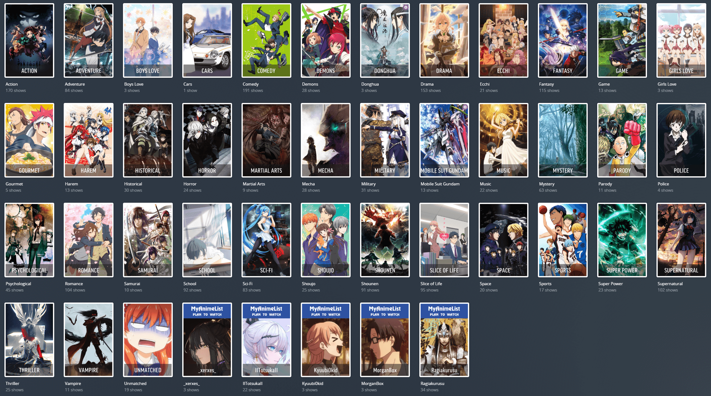

# Evil Tactician's Anime Collections

Anime Collections based on MAL Genres

## Included
* config.yml
* Anime.yml
* Custom Artwork¹
* Photoshop Template¹

¹ Please note that these can only be found on my own repo due to their size: [Evil Tactician's Anime Collections](https://github.com/EvilTactician/Anime-Collections-PMM).

Preview:  

## Instructions

Detailed instructions and latest version can be found here: [Evil Tactician's Anime Collections](https://github.com/EvilTactician/Anime-Collections-PMM).

This repo only contains a preview and the config files.

## Special Thanks
JJJonesJr33 - Original Base Anime.yml & Feedback 
Fribb - Creator of https://github.com/Fribb/anime-lists, helped me track down some mapping issues 
Sohjiro - Creator of Plex Meta Manager

There was quite a bit of work involved in this - and you're welcome to use my assets and templates as you see fit as long as you give credit if you re-distribute them anywhere or include them in another project.

If you wish to say thanks, you can [buy me a coffee](https://ko-fi.com/eviltactician) or wave on Discord.
