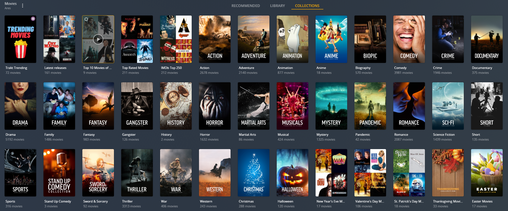
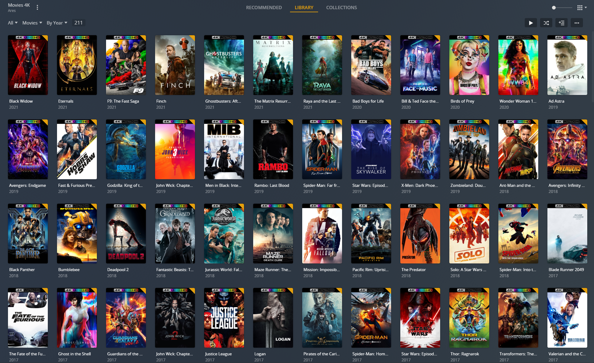

Proper Movie, TV Shows, and Anime configs.

The base config can also be found as config.yml 

For ease of use just copy everything in this folder to your docker container config folder and edit the config.yml to match your settings. Then run the container, open terminal, and use the following command ```python plex_meta_manager.py -r```

FYI: For the Anime config to work you must set up MyAnimeList in your main config using https://github.com/meisnate12/Plex-Meta-Manager/wiki/MyAnimeList-Attributes

Anime Collections Preview: <br>

<br>
Movie Collections Preview: <br>

<br>
TV Shows Collections Preview: <br>

<br>
4K Movie Collections With Overlays Preview: <br>

<br>

Special thanks to the users and their configs that I drew inspiration from
"Hiren-Z, OhMyBahGosh, djnield, Glasti1, tuxpeople" 
And also to the users of Reddit who have contributed to the cause!
