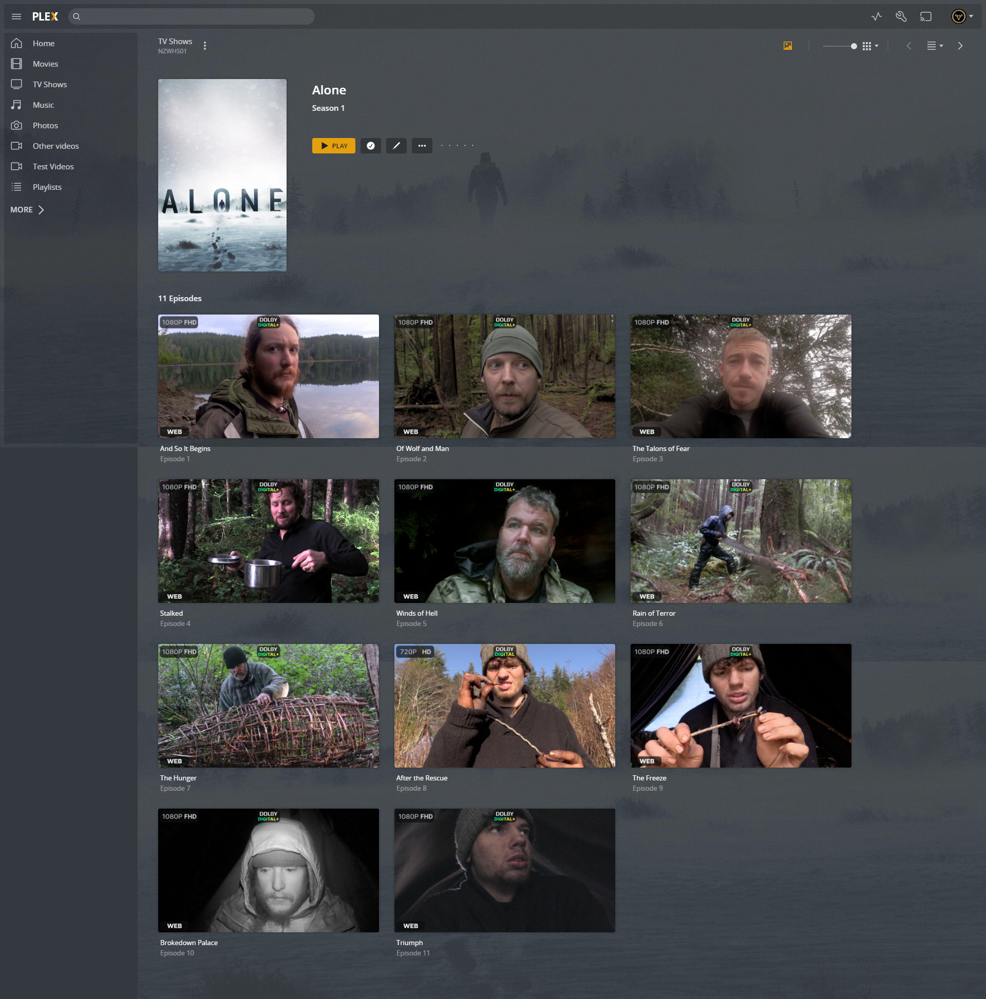
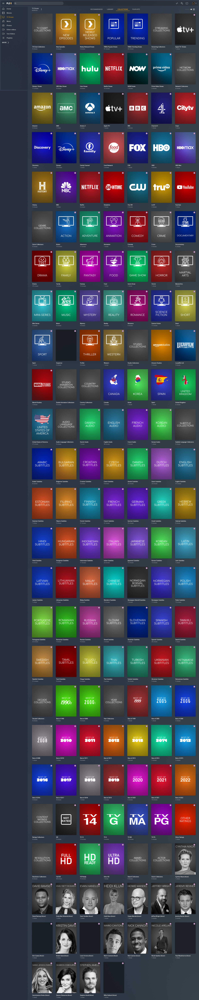

# Plex Meta Manager Default Collections & Overlays

This directory is a central hub for git-based collections and overlays.

The intention of this directory is to offer a "drag and drop" setup for creating the most popular collections and overlays, whilst offering full flexibility of users being able to choose what they do and do not want.
All images associated with this directory are held on GitHub, allowing us to centrally make changes that will deploy to all users of this setup when they next run PMM.

Credits go to Bullmoose20, Sohjiro and Yozora for the concept, design and implementation.
Special thanks to Magic815 for the overlay image inspiration and base template.

## Configurations

### Collections & Overlays

This is an out-of-the-box library mapping that can be copy-and-pasted directly into your config.yml file, replacing everything within the `libraries:` section.

Please ensure to rename the libraries to match your environment.

<details>
  <summary>Click to expand!</summary>
```yml
libraries:                                      # Library mappings must have a colon (:) placed after them
  Movies:
    metadata_path:
    - repo: PMM/actor
      template_variables:
        collection_mode: hide
    - repo: PMM/audio_language
      template_variables:
        collection_mode: hide
    - repo: PMM/choice
      template_variables:
        collection_mode: hide
    - repo: PMM/movie/content_rating_us         # Choose content_rating_uk or content_rating_us
      template_variables:
        collection_mode: hide
    - repo: PMM/genre
      template_variables:
        collection_mode: hide
    - repo: PMM/golden
      template_variables:
        collection_mode: hide
    - repo: PMM/resolution_standards            # Choose resolution_standards or resolution
      template_variables:
        collection_mode: hide
    - repo: PMM/studio
      template_variables:
        collection_mode: hide
    - repo: PMM/studio_animation
      template_variables:
        collection_mode: hide
    - repo: PMM/subtitle_language
      template_variables:
        collection_mode: hide
    - repo: PMM/year
      template_variables:
        collection_mode: hide
    - repo: PMM/movie/award
      template_variables:
        collection_mode: hide
    - repo: PMM/movie/bafta
      template_variables:
        collection_mode: hide
    - repo: PMM/movie/cannes
      template_variables:
        collection_mode: hide
    - repo: PMM/movie/chart
      template_variables:
        collection_mode: hide
    - repo: PMM/movie/country_color             # Choose country_color or country_white
      template_variables:
        collection_mode: hide
    - repo: PMM/movie/decade
      template_variables:
        collection_mode: hide
    - repo: PMM/movie/director
      template_variables:
        collection_mode: hide
    - repo: PMM/movie/franchise
      template_variables:
        collection_mode: hide
    - repo: PMM/movie/oscars
      template_variables:
        collection_mode: hide
    - repo: PMM/movie/producer
      template_variables:
        collection_mode: hide
    - repo: PMM/movie/seasonal_section          # Choose seasonal or seasonal_section
      template_variables:
        collection_mode: hide
    - repo: PMM/movie/spirit
      template_variables:
        collection_mode: hide
    - repo: PMM/movie/streaming
      template_variables:
        collection_mode: hide
    - repo: PMM/movie/sundance
      template_variables:
        collection_mode: hide
    - repo: PMM/movie/writer
      template_variables:
        collection_mode: hide
    overlay_path:
    - repo: PMM/ov_alert
    - repo: PMM/ov_audio_codec_ddplus
    - repo: PMM/ov_audio_codec_dolby-atmos
    - repo: PMM/ov_audio_codec_dolby-digital
    - repo: PMM/ov_audio_codec_dolby-truehd
    - repo: PMM/ov_audio_codec_dts
    - repo: PMM/ov_audio_codec_dts-es
    - repo: PMM/ov_audio_codec_dts-hd
    - repo: PMM/ov_audio_codec_dts-x
    - repo: PMM/ov_audio_language_dual-audio
    - repo: PMM/ov_audio_language_multi-audio
    - repo: PMM/ov_resolution_480
    - repo: PMM/ov_resolution_480-DV
    - repo: PMM/ov_resolution_480-HDR
    - repo: PMM/ov_resolution_720
    - repo: PMM/ov_resolution_720-DV
    - repo: PMM/ov_resolution_720-HDR
    - repo: PMM/ov_resolution_1080
    - repo: PMM/ov_resolution_1080-DV
    - repo: PMM/ov_resolution_1080-HDR
    - repo: PMM/ov_resolution_4K
    - repo: PMM/ov_resolution_4K-DV
    - repo: PMM/ov_resolution_4K-HDR
    - repo: PMM/ov_special_release_criterion
    - repo: PMM/ov_special_release_imax
    - repo: PMM/ov_streaming_amazon
    - repo: PMM/ov_streaming_appletv
    - repo: PMM/ov_streaming_disney
    - repo: PMM/ov_streaming_hbomax
    - repo: PMM/ov_streaming_hulu
    - repo: PMM/ov_streaming_netflix
    - repo: PMM/ov_streaming_paramount
    - repo: PMM/ov_streaming_peacock
    - repo: PMM/ov_top_rated_imdb-top-250
    - repo: PMM/ov_video_format_blu-ray
    - repo: PMM/ov_video_format_dvd
    - repo: PMM/ov_video_format_hdtv
    - repo: PMM/ov_video_format_remux
    - repo: PMM/ov_video_format_web
    - remove_overlays: false
 
  TV Shows:
    metadata_path:
    - repo: PMM/actor
      template_variables:
        collection_mode: hide
    - repo: PMM/audio_language
      template_variables:
        collection_mode: hide
    - repo: PMM/choice
      template_variables:
        collection_mode: hide
    - repo: PMM/show/content_rating_us          # Choose content_rating_uk or content_rating_us
      template_variables:
        collection_mode: hide
    - repo: PMM/genre
      template_variables:
        collection_mode: hide
    - repo: PMM/golden
      template_variables:
        collection_mode: hide
    - repo: PMM/resolution_standards            # Choose resolution_standards or resolution
      template_variables:
        collection_mode: hide
    - repo: PMM/studio
      template_variables:
        collection_mode: hide
    - repo: PMM/studio_animation
      template_variables:
        collection_mode: hide
    - repo: PMM/subtitle_language
      template_variables:
        collection_mode: hide
    - repo: PMM/year
      template_variables:
        collection_mode: hide
    - repo: PMM/show/award
      template_variables:
        collection_mode: hide
    - repo: PMM/show/chart
      template_variables:
        collection_mode: hide
    - repo: PMM/show/country_color              # Choose country_color or country_white
      template_variables:
        collection_mode: hide
    - repo: PMM/show/decade
      template_variables:
        collection_mode: hide
    - repo: PMM/show/network
      template_variables:
        collection_mode: hide
    - repo: PMM/show/streaming
      template_variables:
        collection_mode: hide
    overlay_path:
    - repo: PMM/ov_alert_l
    - repo: PMM/ov_audio_codec_ddplus_l
    - repo: PMM/ov_audio_codec_dolby-atmos_l
    - repo: PMM/ov_audio_codec_dolby-digital_l
    - repo: PMM/ov_audio_codec_dolby-truehd_l
    - repo: PMM/ov_audio_codec_dts_l
    - repo: PMM/ov_audio_codec_dts-es_l
    - repo: PMM/ov_audio_codec_dts-hd_l
    - repo: PMM/ov_audio_codec_dts-x_l
    - repo: PMM/ov_audio_language_dual-audio_l
    - repo: PMM/ov_audio_language_multi-audio_l
    - repo: PMM/ov_resolution_480_l
    - repo: PMM/ov_resolution_480-DV_l
    - repo: PMM/ov_resolution_480-HDR_l
    - repo: PMM/ov_resolution_720_l
    - repo: PMM/ov_resolution_720-DV_l
    - repo: PMM/ov_resolution_720-HDR_l
    - repo: PMM/ov_resolution_1080_l
    - repo: PMM/ov_resolution_1080-DV_l
    - repo: PMM/ov_resolution_1080-HDR_l
    - repo: PMM/ov_resolution_4K_l
    - repo: PMM/ov_resolution_4K-DV_l
    - repo: PMM/ov_resolution_4K-HDR_l
    - repo: PMM/ov_special_release_criterion_l
    - repo: PMM/ov_special_release_imax_l
    - repo: PMM/ov_streaming_amazon_l
    - repo: PMM/ov_streaming_appletv_l
    - repo: PMM/ov_streaming_disney_l
    - repo: PMM/ov_streaming_hbomax_l
    - repo: PMM/ov_streaming_hulu_l
    - repo: PMM/ov_streaming_netflix_l
    - repo: PMM/ov_streaming_paramount_l
    - repo: PMM/ov_streaming_peacock_l
    - repo: PMM/ov_video_format_blu-ray_l
    - repo: PMM/ov_video_format_dvd_l
    - repo: PMM/ov_video_format_hdtv_l
    - repo: PMM/ov_video_format_remux_l
    - repo: PMM/ov_video_format_web_l
    - remove_overlays: false
playlist_files:
  - repo: PMM/playlist
</details>
```
Playlists Preview: <br>

<br>
<br>
Movie Library With Overlays Preview: <br>

<br>
<br>
Movie Collections Preview: <br>

<br>
<br>
TV Shows Library with Overlays Preview: <br>
<br>
<br>
<br>
TV Shows Collections Preview: <br>
<br>
<br>
<br>

Report any issues in the PMM Discord Channels

Submit other requests (image or other) via PMM Discord Channels

Please consider donating towards the project (https://github.com/sponsors/meisnate12).
