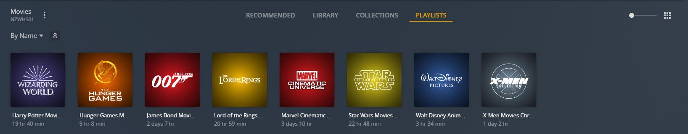
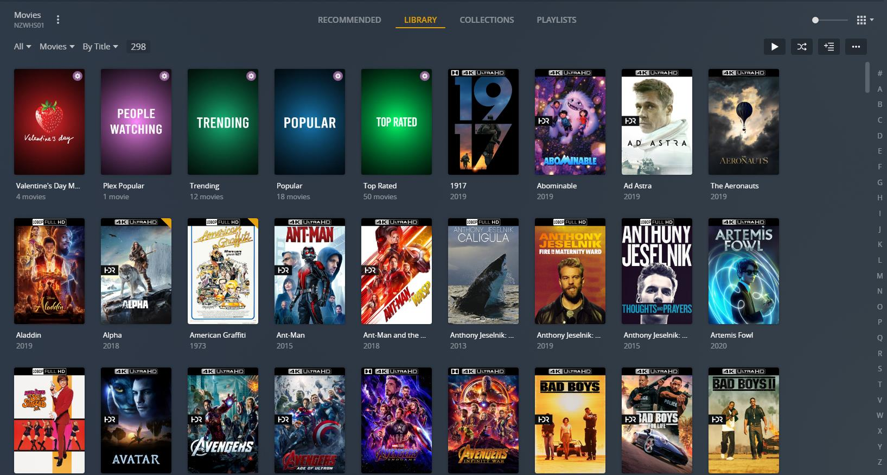
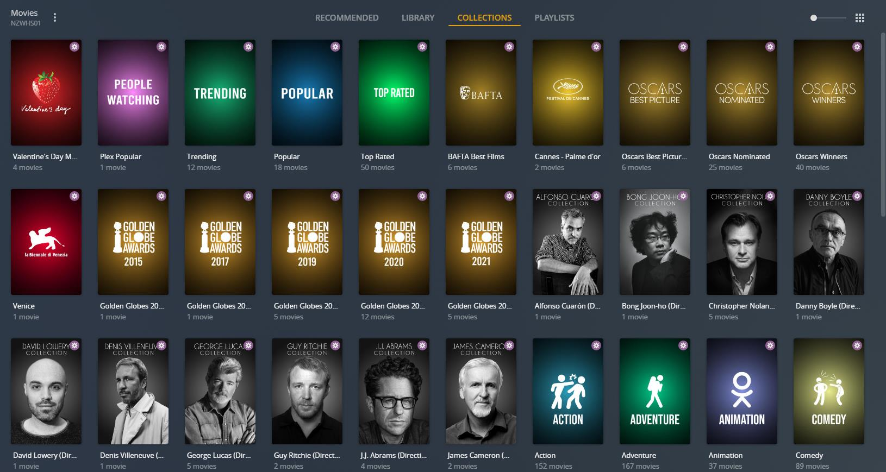
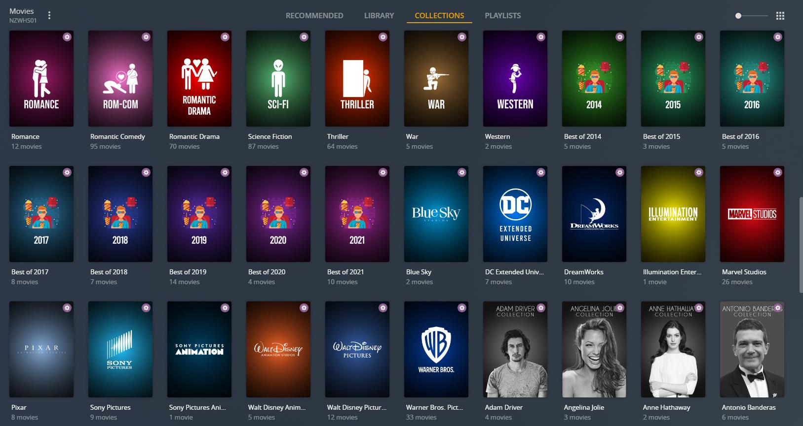
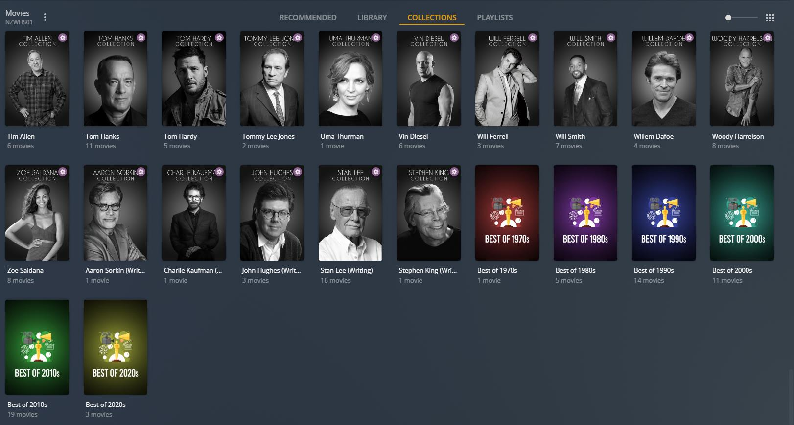
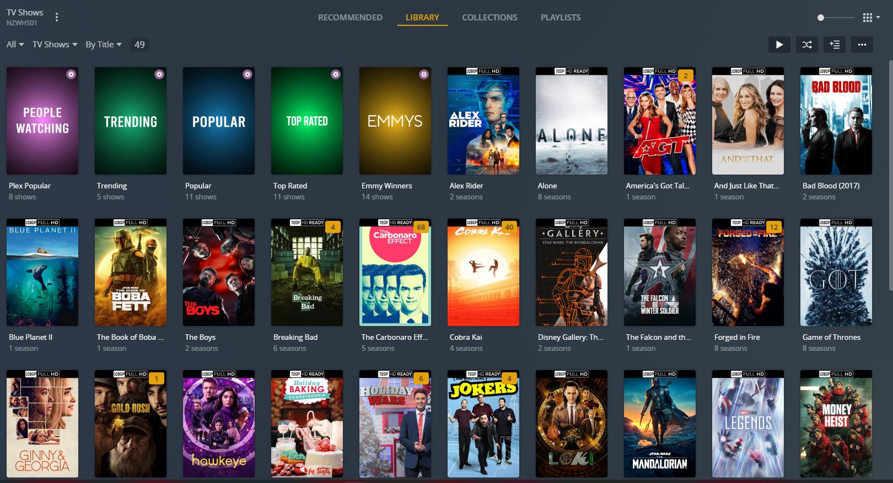
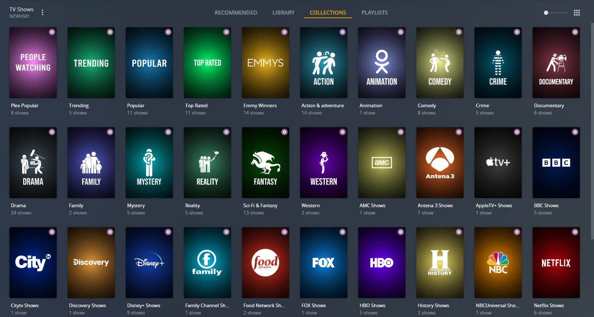

# Plex Meta Manager Configs

This repo contains configs from several people (meisnate12/Sohjiro, Yozora, cpt-kuesel, chazlarson, Frexe, MikeNobbs) and a bit of my own twist. 

A full version of this including all the images/folders/xcf/psd and more that I use can be found here: http://tiny.cc/bullmoose20pmmstuff
For ease of use just unzip everything in the bullmoose20-pmmsetup_<timestamp>.zip file to your docker container config folder and edit the config.yml to match your settings. Then run the container, open terminal/console, and use the following command ```python plex_meta_manager.py -r```

Playlists Preview: <br>

<br>
<br>
Movie Library With Overlays Preview: <br>

<br>
<br>
Movie Collections Preview: <br>

<br>
<br>
Movie Collections Preview Continued: <br>

<br>
<br>
Movie Collections Preview Continued: <br>

<br>
<br>
TV Shows Library with Overlays Preview: <br>
<br>
<br>
<br>
TV Shows Collections with Overlays Preview: <br>
<br>
<br>
<br>

Please consider donating towards the project (https://github.com/sponsors/meisnate12).

NOTE: Some "people" folders will look strange because of Windows. For example: "Robert Downey Jr." has a trailing period which is not acceptable in Windows Folder names