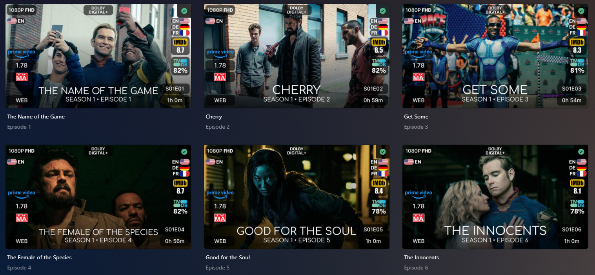

# bullmoose20 Kometa files
## Basics
I run Kometa nightly (not lsio image) and Plex(hotio image) on Unraid 6.12.10. At the top of my config.yml file I will usually specify the version that this config.yml file works with.

## Instructions
Take what you need from my config.yml. I run everything stock from the github default Kometa and tweak from within my config.yml to "make it my own". If you perform a straight copy, search for `(redacted)` as you will need to replace that with your own information. Search for `db_cache` which is for Plex and now available to set via Kometa. I use 2048 MB (2GB) as my system has 168 GB of RAM. You will want to improve it from the default 40 MB that Plex sets. 

> [!TIP]
> Maybe a good starting point if you have enough RAM is 1024 MB which is 1 GB.

> [!NOTE]
> If you want to set the language file to something other than fr (french) do not forget to make that change to `language: fr` lines in the config.yml file before running. As for the `placeholder_imdb_id:` ensure that you read and understand those lines as you may need to choose your own **Movie** or **TV Show** as your library may not have the two references that I have.

Nothing is local other than the fonts which are included in this repo (fonts.zip). These fonts are the best match I could find per ratings site and the ratings overlays. 

Unzip the fonts into `config/metadata/overlays/fonts/` to use this config without modifications.

> [!WARNING]
> You can put the fonts elsewhere, but if you choose to do that, you will need to adjust the ratings section (rating1_font:, rating2_font:, rating3_font:) of the overlays within the config.yml file to point to the location you chose.

## Assets

> [!IMPORTANT]
> I also prefer to have a copy of the local assets so that if I need to recover to the original posters, they are there. I use Posterizarr.ps1 from FSCorrupt's repo to help with that: https://github.com/fscorrupt/Posterizarr . I also use Kometa's assets in a folder structure as described in the wiki here: https://kometa.wiki/en/nightly/kometa/guides/assets/

Essentially, I prefer `tmdb` as a source and textless images all around `["xx"]`. Then I apply a gradient of my choice (`bottom-up-fade.png` & `bottom-up-fade-background.png`), and font of my choice (`Comfortaa-Medium.ttf`) which happens to match the Kometa defaults for Collections. The secrets to all of this are found in the `bullmoose20config.json` file found in the posterizarr subdirectory along with the font and the gradient files.

Unraid Docker-Compose file is also shared and when prompted in Unraid to add a UI Label Icon, use this link: https://raw.githubusercontent.com/fscorrupt/Posterizarr/main/images/webhook.png

After Posterizarr applies my settings Movie example:

After Kometa applies overlays to Movie example:

After Posterizarr applies my settings Show example:

After Kometa applies overlays to Show example:

 

Feel free to ask me questions in the Kometa Discord channel.

 
